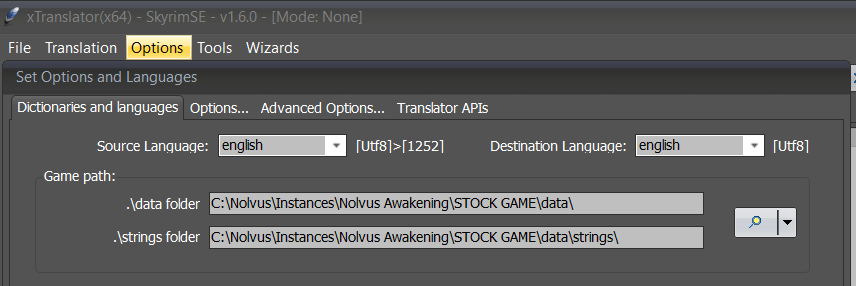
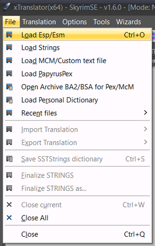
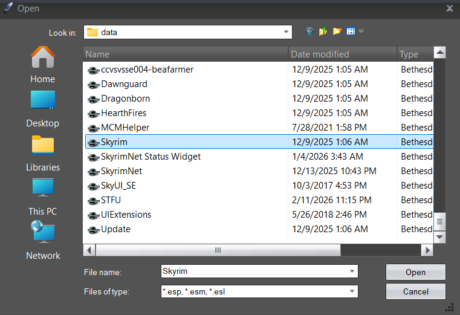
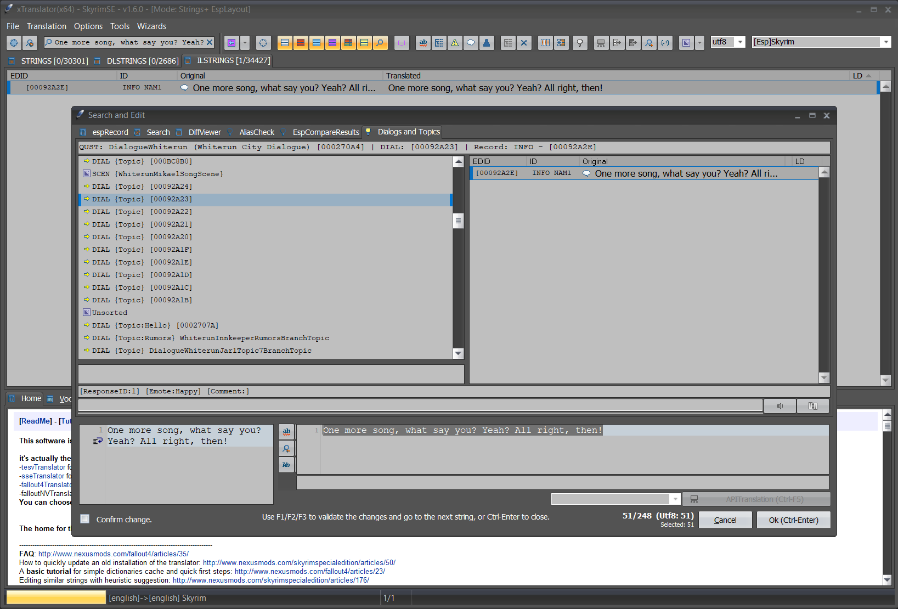
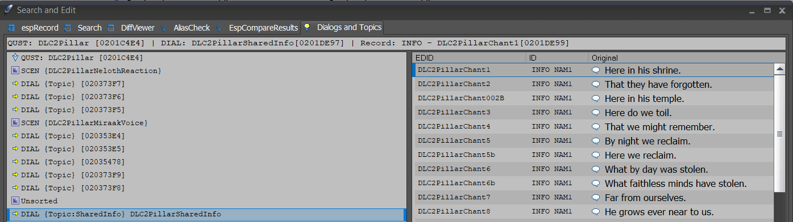
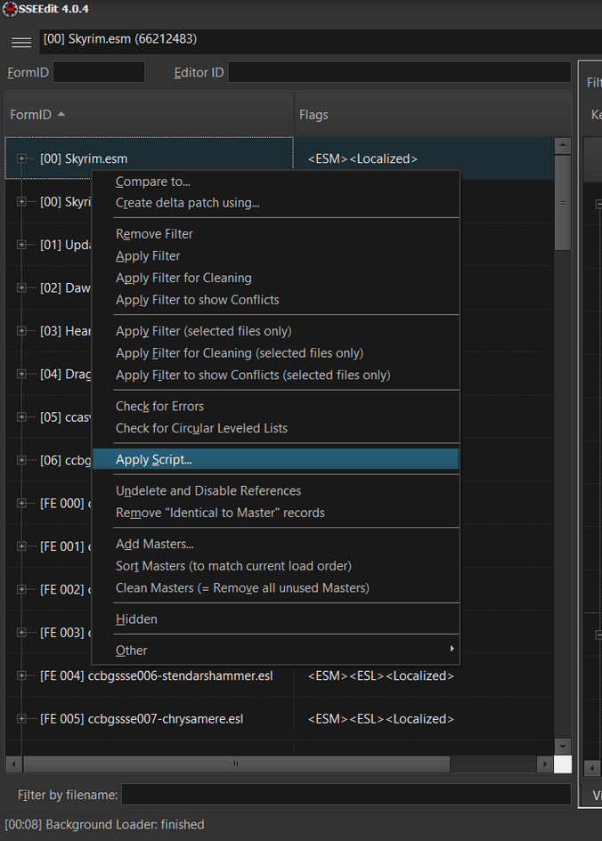
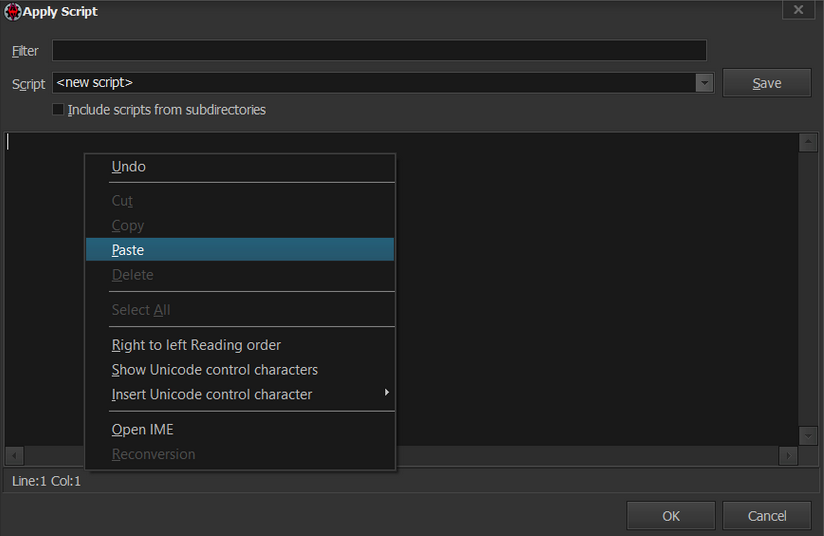
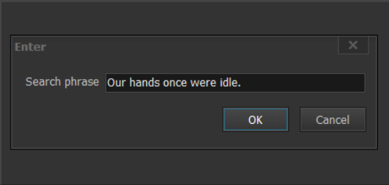
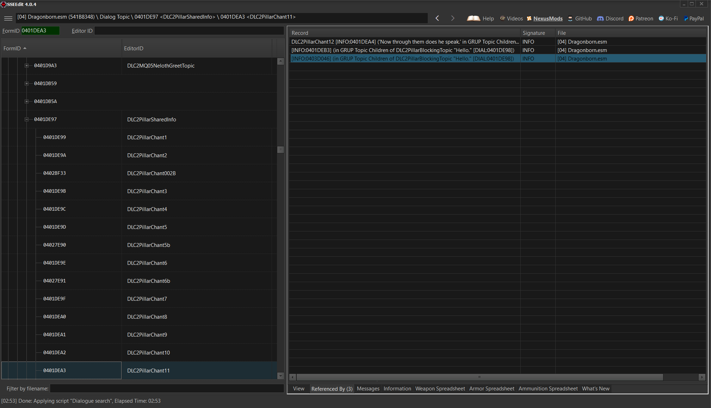
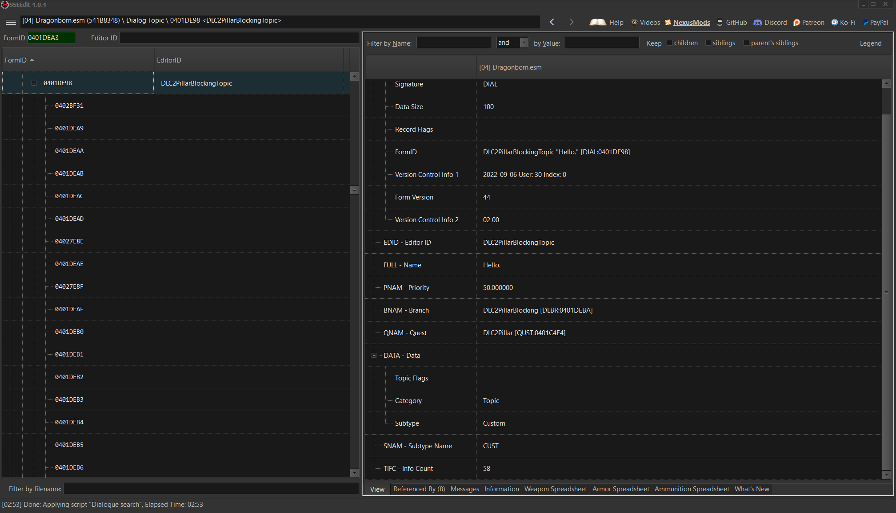

## Configuration Tutorial
In order to add dialogue to the configuration files, you will first need to find the FormID or the EditorID of the topic or scene containing the dialogue you want to block. You can use tools like [xTranslator](https://www.nexusmods.com/skyrimspecialedition/mods/134) or [SSEEdit](https://www.nexusmods.com/skyrimspecialedition/mods/164) with [this script](https://gist.github.com/tasairis/51e530a1af9e8a4be089328376e41108) to search a quote and identify the topic or scene.

For more info on subtypes, see [DIALOGUE_SUBTYPES.md](https://github.com/zevck/S.T.F.U/blob/main/DIALOGUE_SUBTYPES.md)

## xTranslator
xTranslator is the fastest and easiest way to search for dialogue if you know what mod or DLC the dialogue is from. If you have no idea, SSEEdit can be used to search through your entire load order. 

Start with the basic setup of launching xTranslator through your mod manager and assigning your data and strings folders, e.g.:
<p align="center">
  
</p>

Next, load the ESP containing the dialogue you want to look up:
<table>
<tr>
<td></td>
<td></td>
</tr>
</table>

Now you can search for the quote you heard in game. For an example, I'll look for the quote "One more song, what say you? Yeah? All right, then!" from Mikael before he starts singing. Dialogue strings are typically located in the "ILSTRINGS" tab:
<p align="center">
  
</p>

In this case, the dialogue comes from the scene "WhiterunMikaelSongScene" which includes the whole song sequence. Open `STFU_Blacklist.yaml` and add the editorID to block it:
```yaml
#---------------------------
#      Scene blocking
#---------------------------
# Use carefully, this blocks scenes from playing entirely and may break quests that rely on them
scenes:
  - WhiterunMikaelSongScene # <--------
  - WICraftItem01Scene
  - WICraftItem02Scene
  - WICraftItem03Scene
```

If a topic just shows as {Topic} that means it is either Custom or Scene. If it says {Topic:Hello} then that topic belongs to the listed subtype.

If you want to whitelist a topic, such as the Hello dialogue from "DialogueWhiterun" shown above, then add the topic's FormKey or EditorID to `STFU_Whitelist.yaml`. EditorIDs are preferable but not everything has one, in which case you need to use a FormKey which includes a FormID and the ESP/ESM. For example, `02707A:Skyrim.esm`.
```yaml
# Whitelist - Topics that will NEVER be touched by the patcher
# Use this to exclude specific dialogue you want to keep
# Supports both FormKeys and Editor IDs. Editor IDs are recommended for ESPFE plugins
# For any ESP or Editor ID with special YAML characters like [, ], {, }, :, #, @, &, *, etc., use quotes
topics:
  - 02707A:Skyrim.esm # DialogueWhiterun Hello
```
Alternatively, you could choose to whitelist the entire quest "DialogueWhiterun" so that nothing contained within gets blocked.

A limitation of using xTranslator is if you have no idea what the source of the dialogue is, or if the dialogue ends up being SharedInfo. SharedInfo is dialogue that is used by multiple topics and can't be blocked directly. You will need to find the topic that is actually being used in game and for that you need SSEEdit. For example, the chants from enthralled workers in the Dragonborn DLC:
<p align="center">
  
</p>

## SSEEdit
SSEEdit, or xEdit, is a tool that every modder should be acquainted with. Launch it through your mod manager and load all of your mods (or at least the mods with dialogue). To search for dialogue you will need to add [this script](https://gist.github.com/tasairis/51e530a1af9e8a4be089328376e41108). Right click on any ESP/ESM on the left side and select "Apply Script...". Choose "<new script>" then clear the box and paste the linked script. Click save and name it something like "Dialogue search".
<p align="center">
   
</p>

Once the new script is saved click "Apply Script..." again and select "Dialogue search" or whatever you named it. Enter the quote into the box that appears, click OK and wait. This can take awhile, ensure the quote is spelled correctly or you won't find matches.
<p align="center">
  
</p>

Check the "Messages" tab for the search output and lines like:
```
Response: "Our hands once were idle." [Dragonborn.esm] DLC2PillarChant11 [INFO:0401DEA3] ('Our hands once were idle.' in GRUP Topic Children of DLC2PillarSharedInfo [DIAL:0401DE97])
```

Copy the FormID of the SharedInfo response you want contained in [INFO:0xxxxxxx], in this case `0401DEA3`, into the FormID search box in the top left. Click on the "Referenced By" tab on the bottom of the right window and you will see everything that references that response, including the topic's response that is actually playing in game. If this was a normal topic you could skip these steps and jump straight to the topic FormID contained in [DIAL:0xxxxxxx].
<p align="center">
  
</p>

You can double click on the record in the right window to jump straight to it. Navigate up to the topic containing the response and that is what you need. In this case the topic is "DLC2PillarBlockingTopic" and is the Custom subtype.
<p align="center">
  
</p>

You can either add the topic to `STFU_Blacklist.yaml` or `STFU_SubtypeOverrides.yaml` to assign it to a new filter like Idle.
```yaml
# Blacklist - Topics that will be blocked when MCM toggle is OFF
# Supports both FormKeys (with :) and Editor IDs. Editor IDs are recommended for ESPFE plugins
# For any ESP or Editor ID with special YAML characters like [, ], {, }, :, #, @, &, *, etc., use quotes
topics:
 - DLC2PillarBlockingTopic
```
or
```yaml
# Subtype Overrides - Manually correct miscategorized dialogue
# Format: key: subtype
# Key can be FormKey or Editor ID. Editor IDs are recommended for ESPFE plugins.
# For any ESP or Editor ID with special YAML characters like [, ], {, }, :, #, @, &, *, etc., use quotes
overrides:
  DLC2PillarBlockingTopic: Idle #Enthralled worker chants
```

**Done**. Now you just need to save and rerun the patcher to apply the changes.

## STFU_SkyrimNetFilter.yaml
Alternatively, if you still wish to hear the dialogue but wish it wasn't logged by SkyrimNet you can add the topics to `STFU_SkyrimNetFilter.yaml`:
```yaml
# DialogueInterceptor - Blocked Topics Configuration
# These topics will be blocked from SkyrimNet logging
# Scripts still execute (follower commands still work)
topics:
  # Merchant/Service Topics
  - 0x07F6BB  # OfferServiceTopic
  - 0x09CC92  # RentRoomTopic
  # Follower Favor States
  - DialogueFollowerEndFavorState
  - DialogueFollowerContinueFavorState
  - DialogueFollowerDoingFavorBlockingTopic
  - DialogueFollowerFavorStateTopic
  # Follower Commands
  - 0x05C80C  # DialogueFollowerDismissTopic
  - 0x060020  # DialogueFollowerTradeTopic
  - 0x075083  # DialogueFollowerFollowTopic
  - 0x075084  # DialogueFollowerWaitTopic
  - 0x0B0EE6  # Additional follow topic
  # NFF
  - nwsFollowerXStorageTopic

quests: #Block all topics from these quests from being logged
  - nwsFollowerController #NFF follower management dialogue
  - sosQuest #Simple Outfit System dialogue controls
  
subtypes: #Block topics by subtype from being logged in SkyrimNet's event history
  - Hello
```

When using FormIDs in here, they must be entered in hex form with the `0x` prefix. No need for a FormKey. EditorIDs work as normal. You can also optionally block entire subtypes from being logged by SkyrimNet instead of listing every single topic if you wish. For it to take effect, uncheck "Block Hello" in the MCM and check "Block SkyrimNet Logging", as an example.