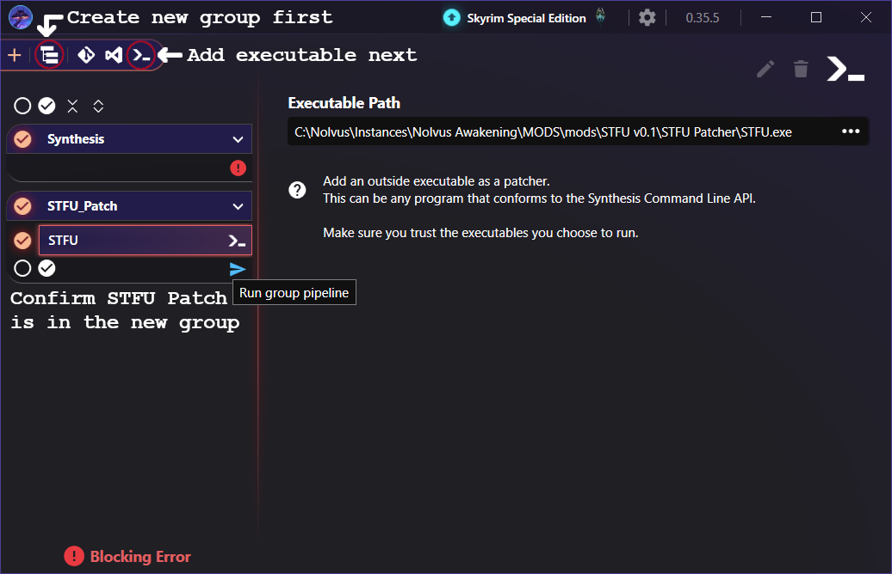
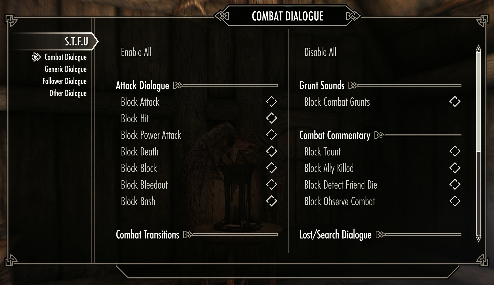

# S.T.F.U - Skyrim Talk Filter Utility
Skyrim Talk Filter Utility allows you to block dialogue from playing at the source with filters for 60+ categories. Block only what you want blocked.

## What This Does
&emsp;S.T.F.U uses the power of Mutagen/Synthesis to patch dialogue responses with conditions that must be true in order for it to be used. Skyrim organizes responses into topics which are assigned into subtypes like Hello, CombatToNormal, KnockOverObject, Taunts, etc. S.T.F.U assigns each subtype with it's own condition variable which can be toggled on or off in the MCM.

&emsp;The patcher scans your entire load order for mods and copies the dialogue into a new ESP with the conditions applied. The patcher doesn't touch any important dialogue like quests or dialogue trees. It is highly customizable with blacklists, whitelists, configs, and 60+ separate filters.


### Blocked Dialogue Types
**Combat Dialogue**: AcceptYield, AlertIdle, AlertToCombat, AlertToNormal, AllyKilled, Attack, AvoidThreat, Bash, Block, Bleedout, CombatToLost, CombatToNormal, Death, DetectFriendDie, Flee, Hit, LostIdle, LostToCombat, LostToNormal, NormalToAlert, NormalToCombat, ObserveCombat, PickpocketCombat, PowerAttack, Taunt, and Yield
  - There is a separate toggle for combat grunt sounds so combat isn't awkwardly silent

**Generic Dialogue**: ActorCollideWithActor, Assault, AssaultNC, BarterExit, DestroyObject, Goodbye, Hello, Idle, KnockOverObject, LockedObject, Murder, MurderNC, NoticeCorpse, PickpocketNC, PickpocketTopic, PlayerCastProjectileSpell, PlayerCastSelfSpell, PlayerInIronSights, PlayerShout, PursueIdleTopic, ShootBow, StandOnFurniture, Steal, StealFromNC, SwingMeleeWeapon, TimeToGo, TrainingExit, Trespass, TrespassAgainstNC, WerewolfTransformCrime, and ZKeyObject

**Follower Dialogue**: Agree, ExitFavorState, Moral Refusal, Refuse, Show, and Follower Commentary

**Other**: VoicePower, Bard songs, a curated list of safe to block scenes, and a custom user-defined blacklist

***NEW***: Prevent certain topics from being included in SkyrimNet's event history. Topics are defined in STFU_SkyrimNetFilter.yaml. Hijacks DialogueItem::Cotr and sets it to null after dialogue plays but before SkyrimNet logs it. Experimental.

This mod does **NOT** block dialogue with the Scene or Custom subtypes, as these are important for game functions and quests. Certain topics belonging to those subtypes can be added to the blacklist if safe.

**DISCLAIMER**: It's possible that a dialogue response that gets blocked could have have an important script attached despite not belonging to the Custom or Scene subtypes. This is why the mod is in beta. So far in my 80+ hours of testing I've only had one minor script related issue which has been fixed. Hello is the most likely subtype to cause issues and is disabled by default.

## Requirements
- **[SkyUI](https://www.nexusmods.com/skyrimspecialedition/mods/12604)** (for MCM)
- **[Synthesis](https://github.com/Mutagen-Modding/Synthesis/releases)** (patcher framework)
- **[.NET 8.0 Runtime](https://dotnet.microsoft.com/download/dotnet/8.0)** or newer

## Installation

### Step 1: Install the Mod
1. Install **S.T.F.U** via your mod manager
2. Enable the mod
3. **Important**: Place `STFU.esp` and any mods with dialogue **ABOVE** any other Synthesis patches in your load order (`Synthesis.esp` for example)
   - If `STFU.esp` is after another patch, the patcher won't detect it

### Step 2: Add Patcher to Synthesis
1. Launch Synthesis through your mod manager
2. Create a new group in the top left corner named "STFU_Patch" or similar
3. Click **"External Program"** in the top left corner
4. Browse to STFU.exe in the "STFU Patcher" folder in the mod directory
5. Click **"Confirm"**
6. Confirm "STFU" is in the new group
7. Run (this will create a new ESP)

<p align="center">
  
</p>

*You will need to rerun the patcher whenever you add or remove mods containing dialogue. If you have multiple patchers all in one group, you will have to rerun all of them each time.

### Step 3: Enable the new ESP in your mod manager
1. Find the new ESP and enable it (it will be named after the Synthesis group)
2. Load the new ESP after STFU.esp and any mods containing dialogue

### Step 4: Load the game and open the MCM
1. Launch the game and open the S.T.F.U MCM
2. Enable the categories you want to block

<p align="center">
  
</p>

### Example load order
- [All mods containing dialogue]
- STFU.esp
- STFU_Patch.esp (or whatever you named the group)
- [Other Synthesis patches]

## Configuration
All config files are in `\STFU Patcher\Config\`:

### STFU_Config.ini
```ini
[General]
; Only process dialogue topics from Skyrim.esm and official DLCs
vanillaOnly = false
; Don't patch any responses with scripts attached, overkill and not recommended
safeMode = false

[Combat]
; Combat-related dialogue subtypes
filterAcceptYield = true
filterAlertIdle = true
filterAlertToCombat = true
filterAlertToNormal = true
filterAllyKilled = true
filterAttack = true
filterAvoidThreat = true
filterBash = true
filterBlock = true
filterBleedout = true
filterCombatToLost = true
filterCombatToNormal = true
filterDeath = true
filterDetectFriendDie = true
filterFlee = true
filterHit = true
filterLostIdle = true
filterLostToCombat = true
filterLostToNormal = true
filterNormalToAlert = true
filterNormalToCombat = true
filterObserveCombat = true
filterPickpocketCombat = true
filterPowerAttack = true
filterPreserveGrunts = true
filterTaunt = true
filterYield = true

[Generic]
; Generic dialogue (non-combat)
filterActorCollideWithActor = true
filterAssault = true
filterAssaultNC = true
filterBarterExit = true
filterDestroyObject = true
filterGoodbye = true
filterHello = true
filterIdle = true
filterKnockOverObject = true
filterLockedObject = true
filterMurder = true
filterMurderNC = true
filterNoticeCorpse = true
filterPickpocketNC = true
filterPickpocketTopic = true
filterPlayerCastProjectileSpell = true
filterPlayerCastSelfSpell = true
filterPlayerInIronSights = true
filterPlayerShout = true
filterPursueIdleTopic = true
filterShootBow = true
filterStandOnFurniture = true
filterSteal = true
filterStealFromNC = true
filterSwingMeleeWeapon = true
filterTimeToGo = true
filterTrainingExit = true
filterTrespass = true
filterTrespassAgainstNC = true
filterWerewolfTransformCrime = true
filterZKeyObject = true

[Follower]
; Follower-specific dialogue
filterAgree = true
filterExitFavorState = true
filterFollowerCommentary = true
filterMoralRefusal = true
filterRefuse = true
filterShow = true

[Other]
; Miscellaneous dialogue filtering
filterBardSongs = true
filterBlacklist = true
; Curated list of repeating town scenes
filterScenes = true
filterVoicePowerEndLong = true
filterVoicePowerEndShort = true
filterVoicePowerStartLong = true
filterVoicePowerStartShort = true
```
### STFU_Blacklist.yaml
Blacklist specific dialogue topics or scenes. Becareful what you include in here, some topics and scenes are essential for the game to function.
```yaml
# Blacklist - Topics that will be blocked when MCM toggle is OFF
# Supports both FormKeys (with :) and Editor IDs. Editor IDs are recommended for ESPFE plugins
# For any ESP or Editor ID with special YAML characters like [, ], {, }, :, #, @, &, *, etc., use quotes
topics:
 - WICastMagicNonHostileSpellStealthTopic
 - WICastMagicNonHostileSpellHealingTopic
 - WICastMagicNonHostileSpellWeirdTopic
 - WICastMagicNonHostileSpellCourageTopic
 - WICastMagicNonHostileSpellCalmTopic
 
plugins: #Block every dialogue response in a plugin. Probably not a good idea
  -
  
#---------------------------
#      Scene blocking
#---------------------------
# Use carefully, this blocks scenes from playing entirely and may break quests that rely on them
scenes:
  - WhiterunMikaelSongScene
  - WICraftItem01Scene
  - WICraftItem02Scene
  - WICraftItem03Scene
  # nwsFollowerFramework.esp
  - nwsFollowerLeveledScene
  
quests: # Block every scene referenced by a quest
  - DA07MuseumScenes

quest_patterns: # EditorIDs only. Use * wildcard to catch multiple quests with similar naming schemes
  # Companions Dialogue Bundle.esp
  - "_JQ_CompanionsScenes*"
```

### STFU_Whitelist.yaml
**Never patch** specific dialogue (protection list):
```yaml
# Whitelist - Topics that will NEVER be touched by the patcher
# Use this to exclude specific dialogue you want to keep
# Supports both FormKeys and Editor IDs. Editor IDs are recommended for ESPFE plugins
# For any ESP or Editor ID with special YAML characters like [, ], {, }, :, #, @, &, *, etc., use quotes
topics:
  # Example: Editor ID
  - WEJS27Hello #Taunting adventurer greeting
  # Example FormKey
  - 062103:Skyrim.esm #Scavenger encounter dialogue
  - 04C592:Skyrim.esm #Draugr Attack dialogue (shouts and laughs)
  - 04C2D2:Skyrim.esm #Ayarg garag gar! (giants)
  # A Cat's Life cat noises
  - ACLDialogueCatsHello
  - ACLCatDialogueFollow
  - ACLCatDialogueBranchReFollowTopic
  - ACLCatDialogueBranchMortalityTopic
  - ACLCatDialogueAdopt
  - ACLCatDialogueDismiss
  - ACLCatDialogueAbandonReject
  - ACLCatDialogueWait
  - ACLCatDialogueCommand
  - ACLDialogueCatsHit
  - CLCatDialogueAssignHome
  - ACLCatDialoguePet
  - ACLCatDialogueAbandonConfirm
  - ACLCatDialogueGiveYarnTopic
  - ACLDialogueCatsMiscSwingWeapon
  - ACLDialogueCatsMiscBow
  - ACLDialogueCatsMiscShout
  - ACLDialogueCatsFlee
  - ACLDialogueCatsMiscCollide

plugins:
  # Example: Don't filter any dialogue from Skyrim on Skooma
  - "Skyrim On Skooma.esp"
  
scenes:
  - 

quests: 
  # Great Cities (houses won't be purchasable if Hello dialogue doesn't trigger quest)
  - WinterholdBuyHomeTGCoWH
  - DialogueKynesgroveBuyHomeTGCoKG
quest_patterns:
 - 
```

### STFU_SubtypeOverrides.yaml
Override subtype classification for specific topics. Originally to fix miscategorized dialogue, it can also be used to blacklist a topic by assigning it to a specific subtype's MCM toggle instead of the blacklist MCM toggle:
```yaml
# Subtype Overrides - Manually correct miscategorized dialogue
# Format: key: subtype
# Key can be FormKey or Editor ID. Editor IDs are recommended for ESPFE plugins.
# For any ESP or Editor ID with special YAML characters like [, ], {, }, :, #, @, &, *, etc., use quotes
overrides:
  DLC2PillarBlockingTopic: Idle #Enthralled worker chants
```

After editing configs, re-run Synthesis to apply changes.

### STFU_SkyrimNetFilter.yaml *NEW*
Prevent certain topics from being logged in SkyrimNet's event history:
```yaml
# DialogueInterceptor - Blocked Topics Configuration
# These topics will be blocked from SkyrimNet logging
# Scripts still execute (follower commands still work)
topics:
  # Merchant/Service Topics
  - 0x07F6BB  # OfferServiceTopic
  - 0x09CC92  # RentRoomTopic
  # Follower Favor States
  - DialogueFollowerEndFavorState
  - DialogueFollowerContinueFavorState
  - DialogueFollowerDoingFavorBlockingTopic
  - DialogueFollowerFavorStateTopic
  # Follower Commands
  - 0x05C80C  # DialogueFollowerDismissTopic
  - 0x060020  # DialogueFollowerTradeTopic
  - 0x075083  # DialogueFollowerFollowTopic
  - 0x075084  # DialogueFollowerWaitTopic
  - 0x0B0EE6  # Additional follow topic
  # NFF
  - nwsFollowerXStorageTopic

quests: #Block all topics from these quests from being logged
  - nwsFollowerController #NFF follower management dialogue
  - sosQuest #Simple Outfit System dialogue controls
  
subtypes: #Block topics by subtype from being logged in SkyrimNet's event history
  - Hello
```

You don't need to need to re-run the patcher if only editing STFU_SkyrimNetFilter.yaml

## Troubleshooting

### // Missing globals, topics aren't patched
    **Problem**: STFU.esp not detected by Synthesis
  
    **Solution**: 
    1. Check that `STFU.esp` is enabled in your mod manager
    2. Move STFU.esp **ABOVE** any other Synthesis patches in load order
    3. Re-run Synthesis

### // Config changes not taking effect
    After editing YAML/INI files, you must re-run Synthesis to regenerate the patch.

### // Dialogue I want is blocked
    Uncheck the subtype in the MCM or add it to `STFU_Whitelist.yaml`. Look below for how to locate dialogue's FormID or EditorID.

### // Dialogue I don't want is NOT blocked
   Check the subtype in the MCM or add it to `STFU_Blacklist.yaml`. Look below for how to locate dialogue's FormID or EditorID.

### // Patch isn't being updated when re-running Synthesis
    Delete the generated patch ESP and run it again.

### // S.T.F.U MCM is loading but nothing is being blocked
    Make sure the generated patch ESP is enabled and below any mods with dialogue. Check the Synthesis output log to ensure it completed without any errors.

### // Can't find the patch ESP after running
    The ESP will be named after the group the patcher was in. Ensure that the patcher completed successfully without errors.

### // Writing with compression enabled is not currently supported
    Move the STFU patch into it's own group that doesn't have compression enabled.

## Useful Tools
You can use these to find the EditorID or FormID of dialogue topics so they can be added to configuration yamls. EditorIDs are better, but FormIDs will work fine for non-ESL flagged mods.
- [xTranslator](https://www.nexusmods.com/skyrimspecialedition/mods/134) Useful for quickly searching through dialogue to find what you want blacklisted or whitelisted
- [xEdit](https://www.nexusmods.com/skyrimspecialedition/mods/164) More detailed information than xTranslator but slower to search
  - [Dialogue Search Scipt](https://gist.github.com/tasairis/51e530a1af9e8a4be089328376e41108)

## Reporting Issues
If you encounter any vanilla dialogue not being blocked when it should, send me the quote and the context that it happened. I won't make patches for modded dialogue, that should be done with the yaml configs.

If you suspect that blocked dialogue broke a quest, please try reloading a save and testing again before blaming me. It's possible a blocked dialogue script somewhere is important, but Skyrim quests can break for any number of reasons. As always, save often.

Ideal test flow:
  - Test quest with STFU enabled --> Quest doesn't work
  - Reload and test quest AGAIN with STFU enabled
    1. Quest works, not my fault
    2. Quest still doesn't work, continue
  - Reload and test quest AGAIN with STFU disabled
    1. Quest still doesn't work, not my fault
    2. Quest works, continue
  - Let me know the quest name or editor ID (preferable) and the mod it's from (or vanilla)

Conversely, don't blame other mod authors if blocking dialogue breaks their quests.

If dialogue you want to hear is being blocked, whitelist it or disable that subtype, leave me alone. You know what you signed up for.

If the patcher gives an error when running, close Synthesis and try again, then check the troubleshooting section. If it's still not working send me the log from the Synthesis output window.

Submit a [github issue](https://github.com/zevck/S.T.F.U/issues) if you think something is wrong

## Credits
- Mutagen/Synthesis Framework