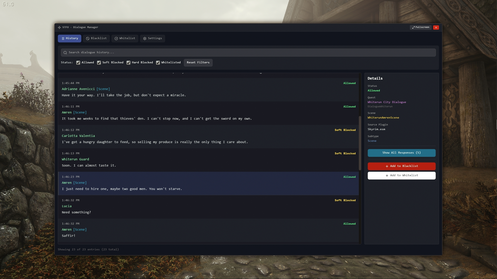

# S.T.F.U — Skyrim Talk Filter Utility
Skyrim Talk Filter Utility gives you full control over what dialogue you hear in game. You can use the intuitive UI to view all recent dialogue and add it to the blacklist. S.T.F.U also ships with options for pre-configured blocking categories. All blocking is handled instantly at runtime.

*No longer requires a Synthesis patcher

## Requirements
- Skyrim Special Edition (1.5.97 or AE) or Skyrim VR
- [SKSE64](https://skse.silverlock.org/)
- [Address Library for SKSE Plugins](https://www.nexusmods.com/skyrimspecialedition/mods/32444)
- [PrismaUI](https://www.nexusmods.com/skyrimspecialedition/mods/148718) *(for the in-game interface)*

(Install it like any other mod)

## How It Works
S.T.F.U runs silently in the background and checks every line of dialogue before it plays. If a line matches your configured rules, it either silences it or blocks it entirely — the NPC keeps moving and doing what they were doing, they just don't say anything.

There are two ways to block dialogue:

### Soft Block *(recommended)*
The audio is silenced and subtitles are hidden, but everything else continues normally. Quest scripts run, follower commands work, conversation flags get set — the game doesn't know anything was blocked. The NPC simply says nothing.

### Hard Block
The dialogue or scene is stopped from running at all. Scripts do **not** execute. Only use this for purely ambient scenes (like bard songs) that have no quest or script involvement — applying a hard block to the wrong thing can break quests.

## What You Can Block
**Individual topics** — silence a specific line or set of lines, identified by name or ID.

**Scenes** — stop an entire scene sequence. Bard performances, inn conversations, ambient banter. Blocked by injecting conditions at runtime with no ESP edits required.

**Quests** — block all dialogue from a specific quest at once. Useful for silencing entire systems like follower management mods.

**Subtypes** — the broadest option. Every line of dialogue in Skyrim has a subtype: `Hello`, `Idle`, `Attack`, `Hit`, `Taunt`, etc. Toggling a subtype off silences thousands of lines at once. See [DIALOGUE_SUBTYPES.md](DIALOGUE_SUBTYPES.md) for the full list.

**Whitelist** — mark topics, scenes, quests, or plugins as protected so they are *never* blocked, even if they match a blacklist rule. Use this to punch exceptions through broad filters.

## In-Game Interface
Open the S.T.F.U menu with the **Insert** key (configurable in the MCM). Requires [PrismaUI](https://www.nexusmods.com/skyrimspecialedition/mods/148718).

<p align="center">
  
</p>

### History Tab
A live, searchable log of every line of dialogue that has played recently — who said it, what quest it belongs to, what subtype it is, and whether it was blocked. Click any entry to open a detail panel where you can immediately add it to your blacklist or whitelist, set the blocking mode, and configure actor/faction filters. This is the fastest way to silence something you just heard in-game.

### Blacklist Tab
The full list of everything currently being blocked. Browse, search, and edit existing entries. Click any entry to change its blocking mode, restrict it to specific actors or factions, or remove it entirely. Supports multi-selection with Ctrl+Click and Shift+Click for bulk edits.

### Whitelist Tab
The full list of everything that is protected from being blocked. Same editing controls as the blacklist tab.

### Settings Tab
- **Enable Blacklist Filter** — master on/off for all blacklist rules
- **Block Ambient Scenes** — toggle the built-in ambient scene blocking
- **Block Bard Songs** — toggle bard performance blocking
- **Subtype toggles** — enable or disable each dialogue subtype individually, with Enable All / Disable All per category
- **Hotkey** — click to rebind the menu key
- **Import Scenes** — restore the default set of blocked scenes and bard songs
- **Import from YAML** — apply changes made to your YAML config files (see below)

### Actor and Faction Filtering
Any blacklist or whitelist entry can be scoped to specific actors or factions. For example: silence a specific topic only when spoken by a particular NPC, or protect a topic only when the speaker belongs to a certain faction.

## Configuring Without the UI
Topics, scenes, and quests can be added to your blacklist and whitelist through plain text YAML files — useful for sharing configs, batch-adding entries, or setting things up before launching the game. Actor and faction filtering requires the in-game UI.

### Where Are the Files?
On first load, S.T.F.U generates blank template files at:
```
SKSE/Plugins/STFU/import/
├── STFU_Blacklist.yaml
├── STFU_Whitelist.yaml
└── STFU_SubtypeOverrides.yaml
```

### Using the Dialogue Log
S.T.F.U logs every intercepted line to:
```
SKSE/Plugins/STFU/STFU_DialogueLog.txt
```
Each entry shows the topic's EditorID or FormKey, the speaker, and what happened to it. You can copy entries directly into your YAML files.
```
[14:01:34] [ALLOWED] [Hello] [DialogueWhiterun] [02707A] Nazeem: Do you get to the Cloud District very often? Oh, what am I saying - of course you don't.
  - 02707A  <--- Copy this
```

### YAML Format
Add entries by EditorID (preferred) or FormKey:
```yaml
topics:
  - WICastMagicNonHostileSpellStealthTopic
  - 0x012345:SomeMod.esp

scenes:
  - WhiterunMikaelSongScene

quests:
  - nwsFollowerController
```
Use quotes for any identifier containing YAML special characters (`[`, `]`, `{`, `}`, `:`, `#`, etc.).

After editing a YAML file, use **Import from YAML** in the Settings tab or MCM to apply your changes — no restart required.

### STFU_SubtypeOverrides.yaml
If a topic is miscategorized (assigned the wrong subtype by the game), you can manually correct it here. You can also use this to add blacklisted topics to specific filter categories.
```yaml
overrides:
  DLC2PillarBlockingTopic: Idle
```
*After editing YAMLs you need to click "Import from YAML" in the settings tab or MCM. No need to restart the game.
